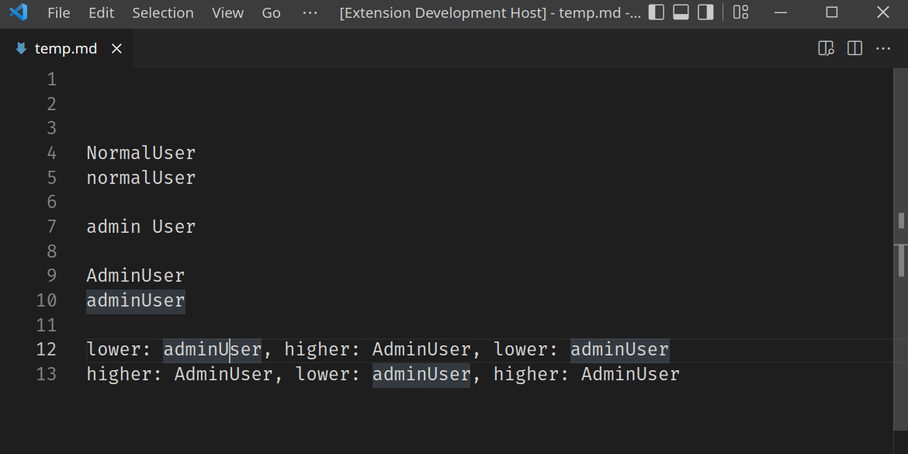

# Auto Case Rename

Simple extension to rename strings in the current file and perform case conversion.

As an example, if the strings `adminUser` and `AdminUser` appear in your file, and the replacement text you provide is `normalUser`, then the replacements will be:

- `adminUser` -> `normalUser`
- `AdminUser` -> `NormalUser`

To use the extension:

- Have an editor window open and place the cursor on a word or select some text.
- Open the command palette (F1 or Cmd + P) and use the command `Rename in current file with auto case conversion`.

## Keywords

- Find replace, case sensitive, case insensitive, rename, current file.

## Release Notes

### 1.0.0

Initial release.